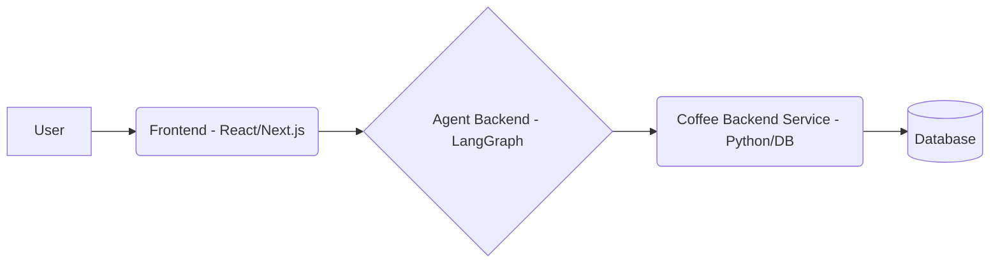

# Product Requirements Document: Agentic Coffee Delivery Demo

## 1. Introduction

This document outlines the requirements for a demonstration project showcasing the integration of a React/Next.js frontend with a Python LangGraph agentic backend. The demo simulates controlling and querying a backend system for a coffee pack delivery service. The primary goal is to illustrate how an AI agent can interact with traditional backend systems to perform tasks based on user requests.

## 2. Goals

- **Demonstrate Agentic Integration:** Showcase how a LangGraph agent can serve as an intelligent interface between a modern frontend and a backend service.
- **Simulate Real-World Interaction:** Provide a tangible example of an agent performing actions (creating clients, shipments) and answering queries (product lists, SLA status, shipment counts) against a simulated backend.
- **Modular Architecture:** Build distinct frontend, agent, and backend components to allow for clear separation of concerns and potential future expansion.
- **Incremental Development:** Start with a core set of essential agent capabilities and backend functionalities, allowing for gradual addition of more complex features.

## 3. System Architecture

The system consists of three main components:

1.  **Frontend:** A web interface built with React and Next.js.
2.  **Agent Backend:** A Python service using LangGraph to process user requests and interact with the Coffee Backend Service.
3.  **Coffee Backend Service:** A Python service simulating the coffee delivery operations, backed by a database.

## 4. Coffee Backend Service

### 4.1 Purpose

To simulate the operational backend of a coffee pack delivery business, providing data and API endpoints for the LangGraph agent to interact with.

### 4.2 Features

- **Technology:** Python (e.g., FastAPI, Flask) with a database (e.g., SQLite, PostgreSQL).
- **Database:**
  - Prefilled with initial data.
  - Tables for:
    - `products` (at least 3 predefined coffee products)
    - `clients`
    - `invoices`
    - `shipments`
    - `sla_issues` (for the artificial SLA system)
- **Artificial SLA System:** A mechanism to simulate Service Level Agreement issues, potentially populated with random data reflecting delays or problems.
- **API Endpoints:** RESTful APIs for the agent to call. Initial endpoints will support the agent's required capabilities (see Section 5.2).

## 5. LangGraph Agent

### 5.1 Purpose

To understand user requests (coming from the frontend) and translate them into actions or queries directed at the Coffee Backend Service APIs.

### 5.2 Capabilities (Initial Scope)

The agent must be equipped with tools/functions to interact with the Coffee Backend Service APIs for the following actions:

- **Client Management:**
  - `create_new_client(name: str, details: dict)`: Adds a new client to the backend.
- **Product Information:**
  - `get_product_list()`: Retrieves the list of available coffee products.
- **Shipment Management:**
  - `create_new_shipment(client_id: int, product_id: int, quantity: int)`: Creates a new shipment record.
- **Reporting & Querying:**
  - `get_sla_status(days: int)`: Retrieves SLA issue information for the last X days.
  - `get_shipment_count(start_date: str, end_date: str)`: Queries the number of shipments within a specified date range.

### 5.3 Future Expansion

The agent's capabilities will be expanded incrementally in future development phases.

## 6. Frontend

### 6.1 Purpose

To provide a user-friendly interface for interacting with the LangGraph agent.

### 6.2 Technology

- React
- Next.js

### 6.3 Functionality

- Display information retrieved by the agent (product lists, SLA status, query results).
- Provide forms or input methods for triggering agent actions (creating clients, shipments).
- Communicate with the Agent Backend (likely via HTTP requests or WebSockets).

## 7. Constraints & Scope

- **Initial Focus:** The primary focus is on demonstrating the core integration pattern between the frontend, agent, and backend.
- **Simulation:** The Coffee Backend Service is a simulation; it does not need to implement complex business logic beyond supporting the defined API interactions.
- **Basic Capabilities:** Start with the fundamental agent capabilities listed in Section 5.2. More complex reasoning or multi-step actions can be added later.
- **UI Simplicity:** The frontend UI should be functional but does not require extensive styling or complex features beyond interacting with the agent.

## 8. Success Metrics

- The frontend can successfully send requests to the agent.
- The agent can correctly interpret requests and call the appropriate Coffee Backend Service APIs.
- The agent can successfully perform all initial capabilities (create client, list products, create shipment, get SLA, get shipment count).
- Data is correctly persisted and retrieved from the Coffee Backend Service's database.
- 

Note: this is an example repository and should NOT be used as a template.
